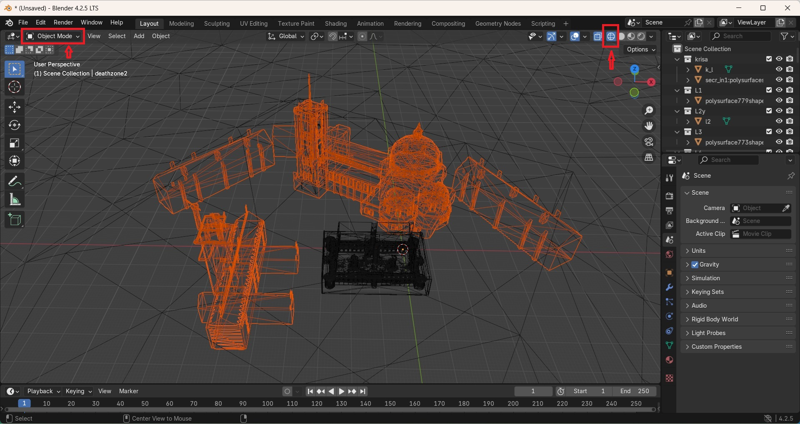
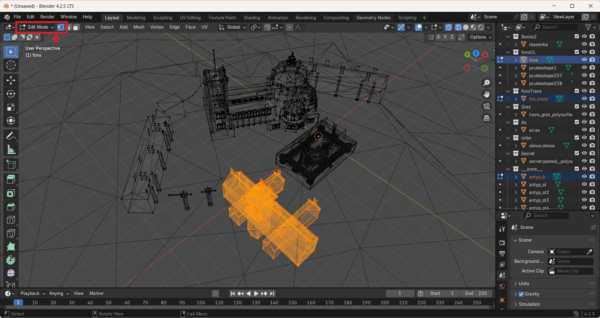
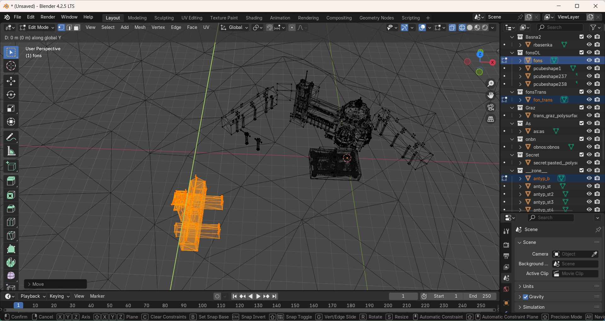

# Move parts of objects in bulk in Blender

Sometimes you may need to move several map objects including zones to another place but simple moving technics just do not work because some objects are too large and a map may contain geometry combined with different objects.

The right way would be to select multiple objects using the combination of **Object Mode** and **Edit mode** selection:

1. Import a map.

2. If the map is too big to observe, you need to increase the `View End` distance in the 3D View area's `Properties` `N` menu > `View` tab. Consult the official Blender documentation.

    !

3. Deselect all objects `Alt - A`.

4. Go to the **X-Ray mode** `Shift - X`. This mode will help you visually to select every detail without missing anything.

5. Select the area you want to move in the **Object mode**. Use `Shift` and click left mouse button two times on objects to deselect parts that are not required. If objects are too lagre, you won't be able to deselect parts of them in the **Object mode**. Here is an example on DM_Sergio, I wanted to select the building on the left but it just did not allow me to do so in the **Object mode**, thus, I was only able to deselect the unwanted map deathzones in this mode:

    !

6. Go to the **Edit Mode** `Tab`.

7. Select the required objects. Use `Shift` to select additional parts. Make sure you selected every surface of the objects. Use the [**fly/walk**](https://docs.blender.org/manual/en/latest/editors/3dview/navigate/walk_fly.html) mode to look around the objects to double check. In this example, the building consists of multiple objects but we select it as one:

    !

8. Now you can proceed with moving the objects. Don't touch the mouse and click `G` then click the axis button `X`,`Y`, or `Z`. Drag the object with the mouse after that. Use `Esc` or `Ctrl - Z` to reset.

    !

9. Exit the **Editor mode** `Tab` and save the changes.
