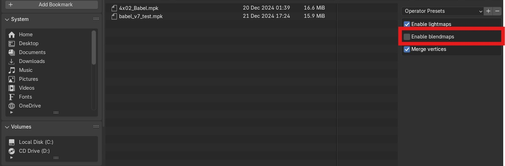

# Blender Painkiller ASE geometry exporter plugin (Outdated)

Blender add-on that exports Painkiller (PC game 2004) MPK geometry in ASE format.

> The plugins were created by dilettante. Tested on [**Blender 4.2 LTS**](https://www.blender.org/download/lts/4-2/).

!!! Note
    The guide was written when we did not have proper MPK exporter for Painkiller. Right now this guide can be considered obsolete but is left here for some corner cases.

Before we got a fully fledged Painkiller MPK exporter for Blender, we had to use a combination of tools: Painkiller Ase Exporter Addon for Blender, Painkiller Lightmap MPK list exporter Blender plugin, ase2mpk (an official People Can Fly tool), and PKBlend.

## Blender plugin installation

You need to install the following plugins for Blender:

1. [**Painkiller Ase Exporter Addon for Blender**](https://github.com/t3r6/Ase-exporter-addon-Blender-PK)

    - [Install](https://docs.blender.org/manual/en/latest/editors/preferences/addons.html) the plugin as a ZIP archive in Blender.

2. [**Painkiller Lightmap MPK list exporter for Blender**](https://github.com/t3r6/Lightmap-mpk-blender)

    - Download the [release ](https://github.com/t3r6/Lightmap-mpk-blender/releases)

    - [Install](https://docs.blender.org/manual/en/latest/editors/preferences/addons.html) the plugin as a ZIP archive in Blender.

## Additional mandatory tools

1. `PKBlend`. You can grab this tool [here](https://github.com/t3r6/Lightmap-mpk-blender/releases).

2. `ase2mpk` is an official People Can Fly tool that is always shipped with the Painkiller game, usually located in the `Painkiller Black Full\Exporters` folder.

Alternatively, the tools can be found on [ModDB](https://www.moddb.com/games/painkiller/downloads/painkiller-converters-mpk-to-ase-and-ase-to-mpk).

## Export

1. Make the necessary changes to the geometry.

2. Since you installed the above mentioned Blender plugins, click `File` > `Export` > `ASCII Scene Exporter`.

3. Pay attention to the exporter settings:

    !

    - **Triangulate**. Note that this option will increase the export time. Better triangulate the whole map manually before the export.

    - **Recalculate Normals**. This option is disabled by default and I suggest leaving it like that because it can break normals on a map during export.

    - **Ivert Y normal**. Should be always enabled if we are going to use `ase2mpk` which is a common situation. This is a workaround since `ase2mpk`  has a bug with inverted normals so basically we will eventually invert normals 2 times to get a proper result.

    - **Remove Doubles**. This option is disabled by default. Removes any duplicate vertices before exporting. Recommended for final maps.

    !!! Warning
        The latest version of the plugin has one noticed bug: it does not transform the hidden objects. Transformations are very important for Painengine so make sure you unhid all the object before the export.

4. Open the system console in case you need to debug the export, it is higly recommended. Go to `Window` -> `Toggle System Console`. 

5. Enter the future `.ase` file name and click `Export`. Exporting process is very slow and can take several minutes depending on a map.

6. Now we need to export the lighmap information from the map using the Painkiller Lightmap MPK plugin which you installed earlier. Click `File` > `Export` > `Painkiller Blendlist (.txt)`.

7. Now you got 2 files, let's say: `untitled.ase` and `untitled.txt`.

8. The next step is to transform our `.ase` geometry into the Painkiller `.mpk` format. Go to the original Painkiller directory or just copy the `ase2mpk.exe` to the directory where you have the `.ase` exported file. This is a command line tool so it should be run from Powershell or CMD:

    ```
    .\ase2mpk.exe -o untitled.ase
    ```

    Follow the command prompt. You should get a similar output:

    ```
    Copyright (c) 2003,2004 People Can Fly
    ase2mpk converts 3ds max ASE files to Pain Engine mpk format
    version 1.2

    mesh data optimization ON, may take a while ...

    Done!

    press any key...
    ```
    
    The conversion is pretty fast. This tool will create `untitled.mpk` in the same directory. If something goes wrong, the tool creates a log file in the same folder.

9. Now it's time to fix lightmaps. This is where [**PKBlend**](https://github.com/t3r6/Lightmap-mpk-blender/releases) comes in handy. We need to combine the blendlist `untitled.txt` with the generated `untitled.mpk`. Run `PKBlend`.

10. You will need to select matching `untitled.txt` and `untitled.mpk` at the same time using `Ctrl - left mouse click`. Then click `Blend`:

    !

    As a result, the `PKBlend` tool will replace `untitled.mpk` with the updated version of `untitled.mpk`. The previous file version will be saved as `untitled.bak`.

    !!! Warning
        Painkiller only supports meshes that have 2 UV map channels. If a mesh have more channels, `PKBlend` will throw an error.

## Blendmaps

!!! Note
    This information is outdated and was added for reference.

!!! Warning
    PKBlend v0.3b does not support blendmaps for meshes that have several materials each of which uses its own blendmap.
    For example, terrain meshes with grass on C5L3_Monastery.

Blendmaps are the mix of textures. The ASE exporter plugin does not export this information. Most often, such complex textures are used for terrain and lava, like on DM_Unseen, DM_Fallen1, C3L6_Forest, C5L4_Hell.

To export such materials properly using the ASE exporter, you need the following prerequisites:

1. A map should be imported with disabled blendmaps:

    !

2. Use [**mpk2ase**](https://github.com/t3r6/pkscripts) on the original map to export the object and texture information. Just drag the map on `mpk2ase.exe`. It'll create several files and you will only need `Obj.txt`.

3. When you complete a map, export by clicking `File` > `Export` > `ASCII Scene Exporter`.

4. Now we need to export the lighmap information from the map using the Painkiller Lightmap MPK plugin which you installed earlier. Click `File` > `Export` > `Painkiller Blendlist (.txt)`.

5. The next step is to transform our `.ase` geometry into the Painkiller `.mpk` format. Go to the original Painkiller directory or just copy the `ase2mpk.exe` to the directory where you have the `.ase` exported file. This is a command line tool so it should be run from Powershell or CMD:

    ```
    .\ase2mpk.exe -o untitled.ase
    ```

    Follow the command prompt. You should get a similar output:

    ```
    Copyright (c) 2003,2004 People Can Fly
    ase2mpk converts 3ds max ASE files to Pain Engine mpk format
    version 1.2

    mesh data optimization ON, may take a while ...

    Done!

    press any key...
    ```
    
    The conversion is pretty fast. This tool will create `untitled.mpk` in the same directory. If something goes wrong, the tool creates a log file in the same folder.

6. Now it's time to fix lightmaps. This is where [**PKBlend**](https://github.com/t3r6/Lightmap-mpk-blender/releases) comes in handy. We need to combine the blendlist `untitled.txt` with the generated `untitled.mpk`. Run `PKBlend`.

7. You will need to select matching `untitled.txt` and `untitled.mpk` at the same time using `Ctrl - left mouse click`. Then click `Blend`:

    !

    As a result, the `PKBlend` tool will replace `untitled.mpk` with the updated version of `untitled.mpk`. The previous file version will be saved as `untitled.bak`.

8. Now get the `Obj.txt` and combine it with the received `untitled.mpk` with `PKBlend` once again.

Sometimes `Obj.txt` is not generated correctly, so you might need to fix it manually. The full list for two objects might look this way. Pay attention that plane01_trans and plane02_trans do not have gaps between them:

```
plane01_trans
0.000000
0.000000
5.000000
5.000000
my_lightmap
my_blendmap
0.000000
0.000000
1.000000
1.000000
my_alphamask
plane02_trans
0.000000
0.000000
5.000000
5.000000
my_lightmap
my_blendmap
0.000000
0.000000
1.000000
1.000000
my_alphamask
```

If you see gaps and some fields are missing, it means whether the original mesh did not have them or these was an incomplete export and you need to fix the list manually.
