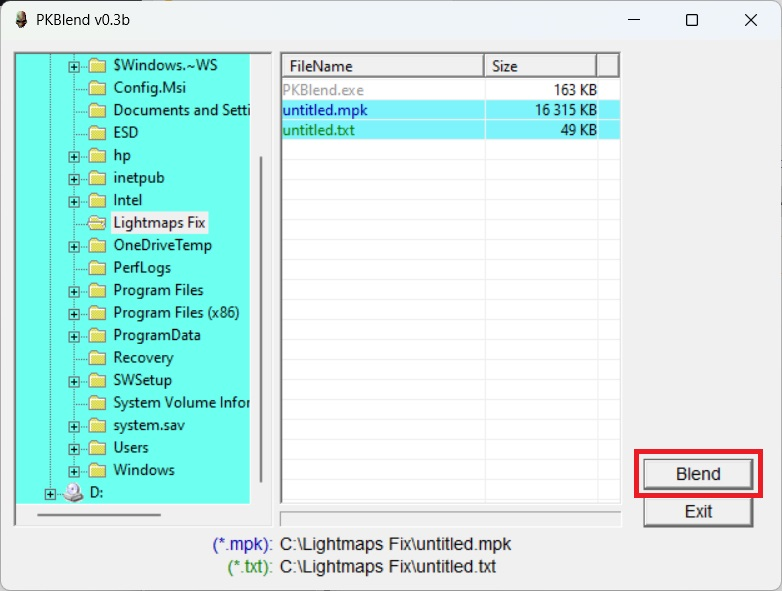

# Blender Painkiller ASE geometry exporter plugin (Outdated)

Blender add-on that exports Painkiller (PC game 2004) MPK geometry in ASE format.

> The plugins were created by dilettante. Tested on [**Blender 4.2 LTS**](https://www.blender.org/download/lts/4-2/).

!!! Note
    The guide was written on December 22, 2024 and is actual at the time of writing. Some information may be outdated by the time you read it.

Currenly, we do not have a fully fledged Painkiller MPK exporter for Blender so we need to use a combination of tools: Painkiller Ase Exporter Addon for Blender, Painkiller Lightmap MPK Blender plugin, ase2mpk (an official People Can Fly tool), and PKBlend.

## Blender plugin installation

You need to install the following plugins for Blender:

1. [**Painkiller Ase Exporter Addon for Blender**](https://github.com/t3r6/Ase-exporter-addon-Blender-PK)

    - Download the [release](https://github.com/t3r6/Ase-exporter-addon-Blender-PK/releases)

    - [Install](https://docs.blender.org/manual/en/latest/editors/preferences/addons.html) the plugin as a ZIP archive in Blender.

2. [**Painkiller Lightmap MPK for Blender**](https://github.com/t3r6/Lightmap-mpk-blender)

    - Download the [release ](https://github.com/t3r6/Lightmap-mpk-blender/releases)

    - [Install](https://docs.blender.org/manual/en/latest/editors/preferences/addons.html) the plugin as a ZIP archive in Blender.

## Additional mandatory tools

1. `PKBlend`. You can grab this tool [here](https://github.com/t3r6/Lightmap-mpk-blender/releases).

2. `ase2mpk` is an official People Can Fly tool that is always shipped with the Painkiller game, usually located in the `Painkiller Black Full\Exporters` folder.

Alternatively, the tools can be found on [ModDB](https://www.moddb.com/games/painkiller/downloads/painkiller-converters-mpk-to-ase-and-ase-to-mpk).

## Export

1. Make the necessary changes to the geometry.

2. Since you installed the above mentioned Blender plugins, click `File` > `Export` > `ASCII Scene Exporter`.

3. Pay attention to the exporter settings:

    !

    - **Triangulate**. There might be an issue when this plugin cannot export geometry if a mesh was edited in place. This option helps to avoid such issues. If the plugin throws errors during export, try to export with this option enabled. Note that this option will increase the export time.

    - **Recalculate Normals**. This option is disabled by default and I suggest leaving it like that because it can break normals on a map during export.

    - **Ivert Y normal**. Should be always enabled if we are going to use `ase2mpk` which is a common situation. This is a workaround since `ase2mpk`  has a bug with inverted normals so basically we will eventually invert normals 2 times to get a proper result.

    - **Remove Doubles**. This option is disabled by default. Remove any duplicate vertices before exporting. Not tested. I recommend keeping it off.

4. Enter the future `.ase` file name and click `Export`. Exporting process can take several minutes depending on a map.

5. Now we need to export the lighmap information from the map using the Painkiller Lightmap MPK plugin which you installed earlier. Click `File` > `Export` > `Painkiller Blendlist (.txt)`.

6. Now you got 2 files, let's say: `untitled.ase` and `untitled.txt`.

7. The next step is to transform our `.ase` geometry into the Painkiller `.mpk` format. Go to the original Painkiller directory or just copy the `ase2mpk.exe` to the directory where you have the `.ase` exported file. This is a command line tool so it should be run from Powershell or CMD:

    ```
    .\ase2mpk.exe -o untitled.ase
    ```

    Follow the command prompt. You should get a similar output:

    ```
    Copyright (c) 2003,2004 People Can Fly
    ase2mpk converts 3ds max ASE files to Pain Engine mpk format
    version 1.2

    mesh data optimization ON, may take a while ...

    Done!

    press any key...
    ```
    
    The conversion is pretty fast. This tool will create `untitled.mpk` in the same directory.

8. Now it's time to fix lightmaps. `ase2mpk` has a bug that breaks lightmaps during the conversion. This is where [**PKBlend**](https://github.com/t3r6/Lightmap-mpk-blender/releases) comes in handy. We need to combine the blendlist `untitled.txt` with the generated `untitled.mpk`. Run `PKBlend`.

9. You will need to select matching `untitled.txt` and `untitled.mpk` at the same time using `Ctrl - left mouse click`. Then click `Blend`:

    !

    As a result, the `PKBlend` tool will replace `untitled.mpk` with the updated version of `untitled.mpk`. The previous file version will be saved as `untitled.bak`.

    !!! Warning
        Painkiller only supports meshes that have 2 UV map channels. If a mesh have more channels, `PKBlend` will throw an error.

## Prepare map for PainEditor

A simple Painkiller map has the following structure:

    - Painkiller/Data/Levels/Mapname
    - Painkiller/Data/Maps/mapname.mpk
    - Painkiller/Data/Textures/Levels/mapname

1. Put the `untitled.mpk` into the `Painkiller/Data/Maps` folder.

2. Make sure you don't have any Havok `MOPPCode` of the similar `.mpk` file generated before. If so, delete the `Painkiller/Data/Maps/MOPPCode/untitled.mpk` folder.

    !!! Warning
        You always need to remove the automatically generated `MOPPCode` each time you create a new geometry within the same file name before running a map. `MOPPCode` can lead to unexpected results when it does not match the version of the `.mpk` file.

3. Open `Painkiller/Data/Levels/DM_Untitled/DM_Untitled.CLevel` with a notepad and change the following line to match your new geometry file:

    ```
    o.Map = "untitled.mpk"
    ```

4. The folder with the textures should match the name of the MPK file: `Painkiller/Data/Textures/Levels/untitled`. If it does not match, you won't see textures on your map.

5. Run your map in PainEditor to check if the map configuration was correct.
