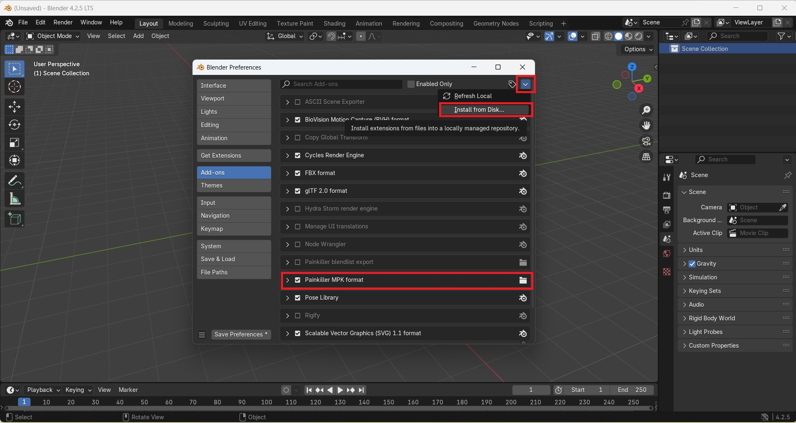
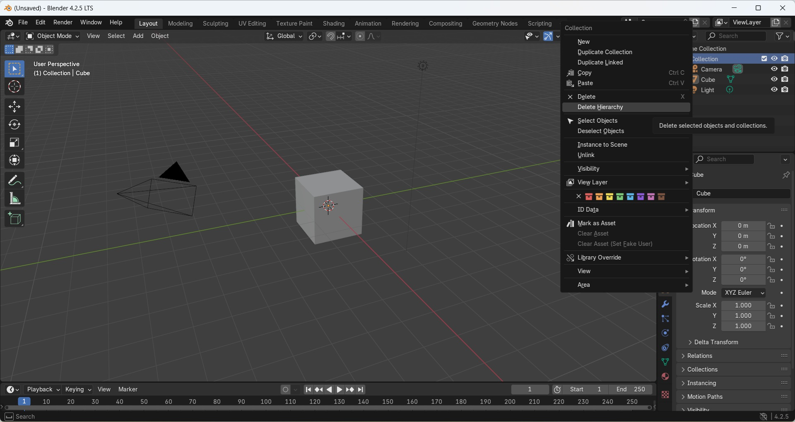
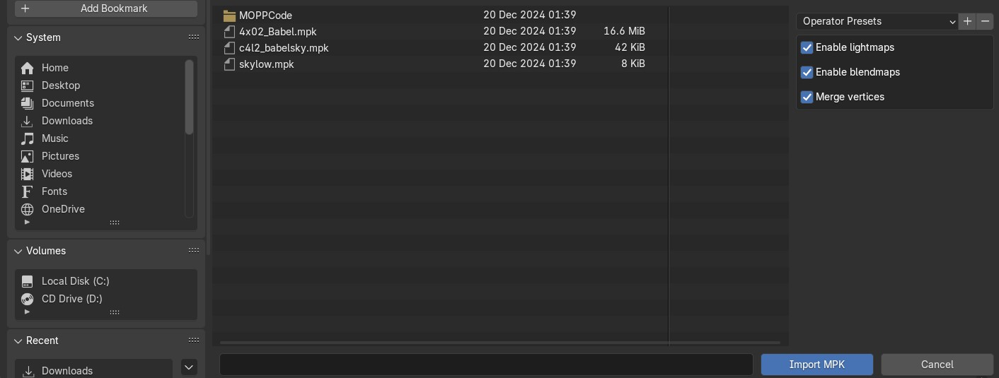
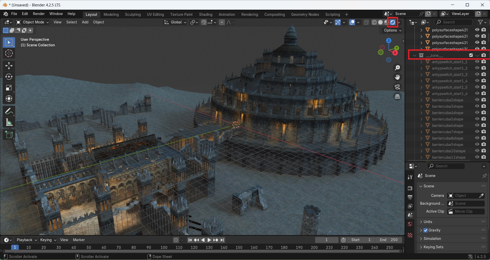
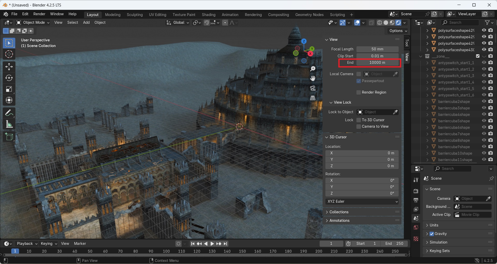

# Blender Painkiller MPK geometry importer plugin

!!! Warning
    Blender constraints: the current max ID names size is 63 usable bytes (for example, a mesh name). This limit should be increated in [Blender 5](https://projects.blender.org/blender/blender/issues/137608).
    It means that some Painkiller mesh names could be cut during the map import; it's the usual case with the maps from Painkiller Resurrection but can happen in any PainEngine/NecroEngine game. Since some mesh names might contain specific key words for the engine, like "barrier", you need to pay attention to those cut names and rename them accordingly after the import.

Blender add-on that imports Painkiller (PC game 2004) MPK geometry files.

PainEditor is not capable of editing geometry files for Painkiller. It's mostly designed to create gameplay and atmosphere.

In order to edit an MPK geometry files for Painkiller, you need a 3D editor like Autodesk Maya, Autodesk 3ds Max, or Blender. This guide is aimed at Blender.

> The plugin was created by dilettante. Tested on [**Blender 4.2 LTS**](https://www.blender.org/download/lts/4-2/).

!!! Note
    The guide was edited on May 04, 2025 and is actual at the time of writing. Some information may be outdated by the time you read it.

The main plugin [**repository**](https://github.com/max-ego/PK_tools).

Backup [**repository**](https://github.com/t3r6/PK_tools).

## Installation via GUI

1. Download the latest plugin version from GitHub. Pick the latest [**relese**](https://github.com/max-ego/PK_tools/releases).

2. Either use the prepared ZIP archive from the GitHub release assets or create a ZIP archive that should contain the `io_scene_mpk` folder and the plugin python scripts inside:

    ```
    io_scene_mpk\__init__.py
    io_scene_mpk\import_mpk.py
    ```

3. In Blender, open `Edit` > `Preferences` and switch to the `Add-ons` section.

4. Click on the drop down menu at the upper right, select `Install from Disk...`, and choose the ZIP archive with the plugin.

    !

5. Search for the add-on on the list: enter `Painkiller MPK format` and tick it to enable.

## Manual Installation

1. Download the latest plugin version from GitHub.

2. Put the unpacked `io_scene_mpk` folder with the python scripts to `C:\Program Files\Blender Foundation\Blender 4.2\4.2\scripts\addons`:

    ```
    C:\Program Files\Blender Foundation\Blender 4.2\4.2\scripts\addons\io_scene_mpk\__init__.py
    C:\Program Files\Blender Foundation\Blender 4.2\4.2\scripts\addons\io_scene_mpk\import_mpk.py
    ```

    Alternative path:

    ```
    %AppData%\Blender Foundation\Blender\4.2\scripts\addons\
    ```

## Import

Once the addon has been installed, you will be able to import Painkiller MPK geometry.

1. [**Extract**](../modding/pk-unpack.md) a PKM or a PAK archive with the map geometry and textures.

    !!! Note
        The texture folder usually has the same naming as the geometry file name. For example, `Maps.pak/4x02_Babel.mpk` geometry has corresponding textures in `Textures.pak/Levels/4x02_Babel`.

2. Create a new folder and copy the MPK geometry file and all the map textures to that folder.

3. In Blender, delete the default scene: in the upper right of your screen, right-click on `Collection` > `Delete Hierarchy`.

    !

4. Make sure you deleted everytihng from the Blender default scene collection. Save the new defaults so that Blender default example objects won't interfere with your imported geometry. Because you always import on top of something, the workspace should be clean. Go to `File` > `Defaults` > `Save Startup File`.

5. Import Painkiller MPK geometry file via `File` > `Import` > `Painkiller World Mesh (.mpk)`.

    !

    !!! Notes
        * Merge verticies is enabled by default and recommended. It will join all the closest separated geometry.

6. Deselect all objects `Alt - A`.

7. Click `Shading` > `Display render preview` in Blender. Now you will be able to see the map with textures and lightmaps.

8. Find the collectoin with the `__zone__` name and click on the `eye` to disable it from Viewport. This collection includes portals (do not confuse it with teleports), antiportals, and zones.

    !

9. If the map is too big to observe, you need to increase the `View End` distance in the 3D View area's `Properties` `N` menu > `View` tab. Consult the official Blender documentation.

    !

10. Navigate with the [**fly/walk**](https://docs.blender.org/manual/en/latest/editors/3dview/navigate/walk_fly.html) mode `Shift-~` and use the mouse scroll wheel to control the speed. If you are new to Blender, start learning from navigation basics. There are plenty of tutorials online.

## Uninstall via GUI

1. In Blender, open `Edit` > `Preferences` and switch to the `Add-ons` section.

2. Search for the `Painkiller MPK format` plugin.

3. Click on the dropdown menu and remove the plugin by clicking `Remove`.

## Uninstall manual

Remove the following files from the Blender folder:

```
C:\Program Files\Blender Foundation\Blender 4.2\4.2\scripts\addons\io_scene_mpk\__init__.py
C:\Program Files\Blender Foundation\Blender 4.2\4.2\scripts\addons\io_scene_mpk\import_mpk.py
```

Alternative path:

```
%AppData%\Blender Foundation\Blender\4.2\scripts\addons\
```