# Cubemaps in Painkiller

!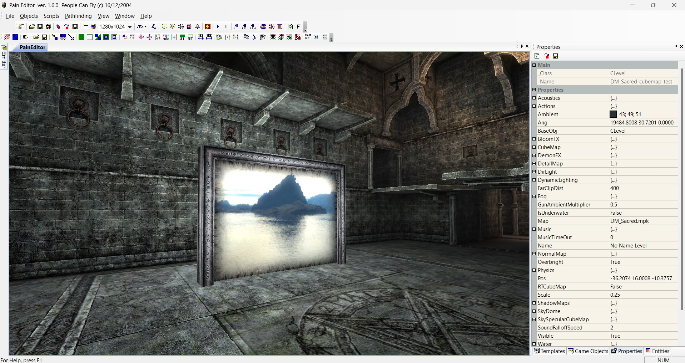

A cubemap aka skybox is a texture that contains 6 individual 2D textures that each form one side of a cube: a textured cube.

Cubemaps in Painkiller are used for teleports on any settings and water on low settings.

It's possible to use cubemaps for skyboxes in Painkiller assigned to outer cube like in most other games; however, Painkiller uses skydomes by default, which is a different technololy and skyboxes are not recommended because a skybox will block the vision of any skydome on the map in this case.

!!! Warning

    Cubemap sizes should be proportional: 512x512, 1024x1024, 2048x2048, 4096x4096.

## Assemble cubemaps/skyboxes from sources for Painkiller

It's difficult to find one image cubemaps/skyboxes in the internet. They are usually shipped as 6 separate images (back, bottom, front, left, right, top).

Check the relations between the axis and the images on this picture:

!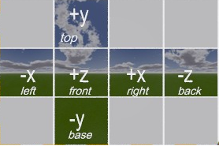

!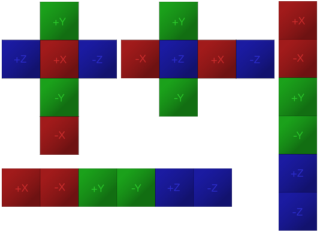

!!! Note

    X+ (right);
    X- (left);
    Y+ (top);
    Y- (bottom);
    Z+ (front);
    Z- (back)

Let's assemble a cubemap/skybox. You can download all the image sources [here](https://github.com/t3r6/pkdocs/tree/main/docs/img/cubemap/skybox_example).

You need Photoshop or free and opensource [GIMP](https://www.gimp.org/) for this procedure. I will be using GIMP.

!!! Note

    Painkiller uses the following names for the cubemap layers:

    | Layer name    | Image side |
    | ------------- | ---------- |
    | main surface (positive x) | right |
    | main surface (negative x) | left |
    | main surface (positive y) | top |
    | main surface (negative y) | bottom |
    | main surface (positive z) | front |
    | main surface (negative z) | back |

#### Example 1

1. This step is not necessary but I recommend reducing the size of each image to 512x512. That's the size Painkiller uses for the default cubemaps.

    * Open each image in GIMP and choose **Image** -> **Scale Image**.
    * Put width and height 512.
    * Click **Scale**.
    * To save it, click **File** -> **Export as**. Name it as a resized image and click **Export**.
    * Change quality to 100% and click **Export**.

    !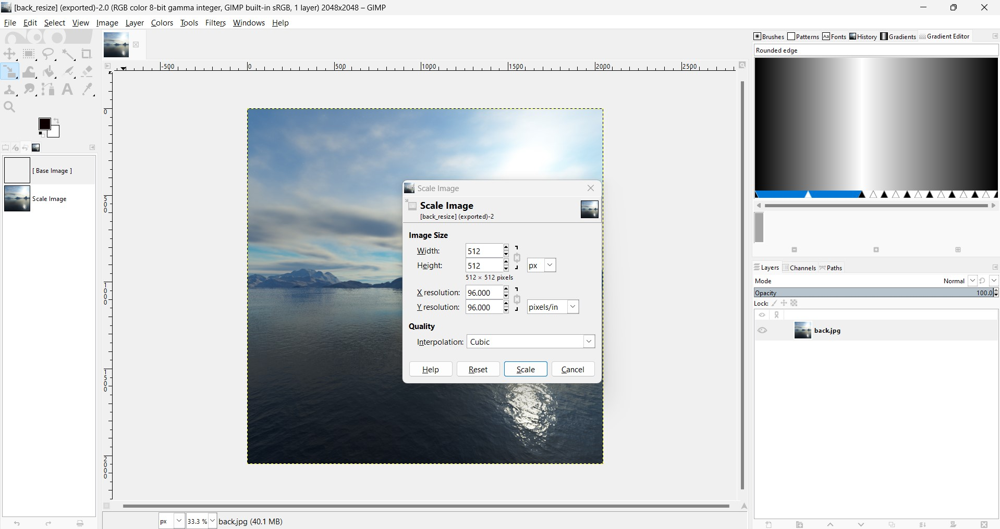
    !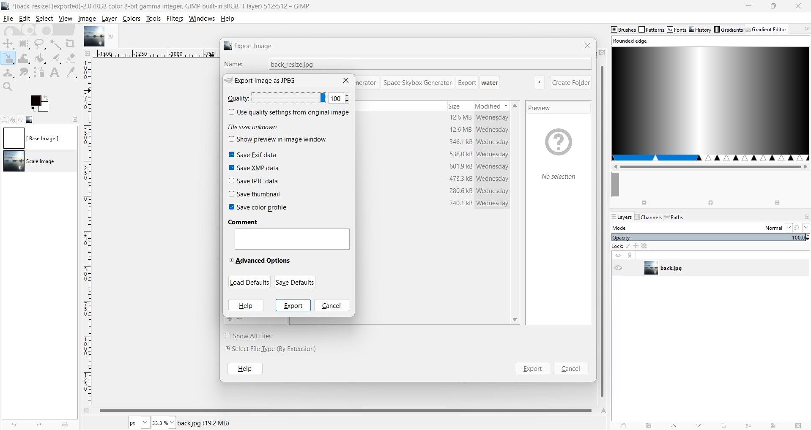

2. Create layers

    * Once all images are resized, open any resized image in GIMP and drag and drop other images as layers to the GIMP Layers pane:

    !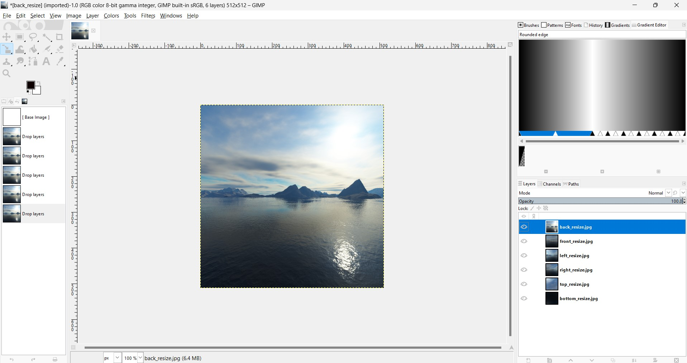

    * Rename the layers according to the scheme matching the sides to the corresponing images (the order of layers does not matter but I will keep to the Painkiller defaults):

    !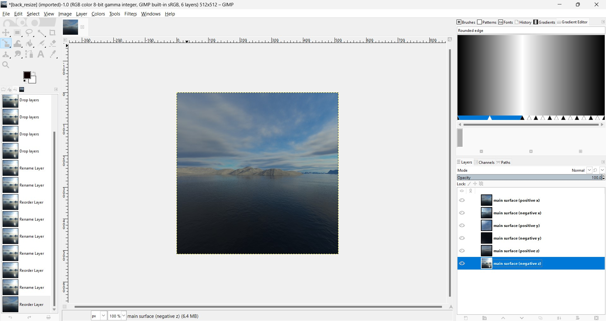

    * Click **File** -> **Export as**, choose **Select File Type (by extentions)**, find first **dds** from the list, rename the file to, for example, "scene1_cubemap.dds", and click **Export**.

    * Use the following settings:

        - Compression: BC1/DXT1

        - Save: As cube map

    !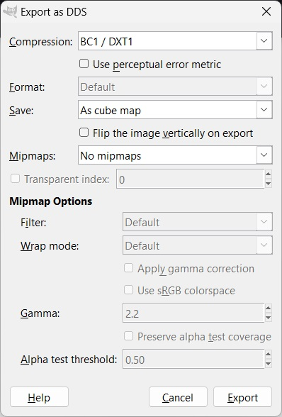

3. Test the cubemap.

    I will use DM_Sacred for testing.

    * [**Extract**](pk-packages.md) DM_Sacred folder from Painkiller `Data/Levels.pak`. Do not use PainEditor for this because it won't extract MapEntities. Use only custom extraction tools.

    * Copy the extracted DM_Sacred folder to `Data/Levels`. Create folders if required. The path should be `Painkiller/Data/Levels/DM_Sacred`.

    * Rename the map so that it won't conflict with the original. You need to rename the map Levels folder and the Clevel file. the  For example, `Painkiller/Data/Levels/DM_Sacred_cubemap_test/DM_Sacred_cubemap_test.CLevel`

        ```
            .
        └── DM_Sacred_cubemap_test
            ├── CAcousticEnv
            ├── CArea
            ├── CBillboard
            ├── CBox
            ├── CEnvironment
            ├── CItem
            ├── CLight
            ├── CParticleFX
            ├── CSound
            ├── DM_Sacred_cubemap_test.CLevel
            └── MapEntities
        ```

    * Copy your cubemap file to `Painkiller\Data\Textures\Special\scene1_cubemap.dds`. I named it as "scene1_cubemap.dds". Create folders if do not exist.

    * Open `..\Painkiller\Data\Levels\DM_Sacred_cubemap_test\MapEntities\tele5_ashape.EMesh` and change the line `o.CubeMap.Tex = "special\\dziedz_d_obrucona"` to `o.CubeMap.Tex = "special\\scene1_cubemap"` without extension.

    * Open the game or PainEditor and check the teleport on DM_Sacred_cubemap_test

    !

#### Example 2

Let's make a Quake 1 like teleport for Painkiller.

1. Download [Space Skybox Generator](https://mikletuapse.itch.io/space-skybox-generator).

2. Generate a skybox with 512x512 pictures using Space Skybox Generator. It will generate 6 images into the Export folder.

3. Assemble the skybox like it was previously described.

4. Apply it to DM_Sacred_cubemap_test.

    !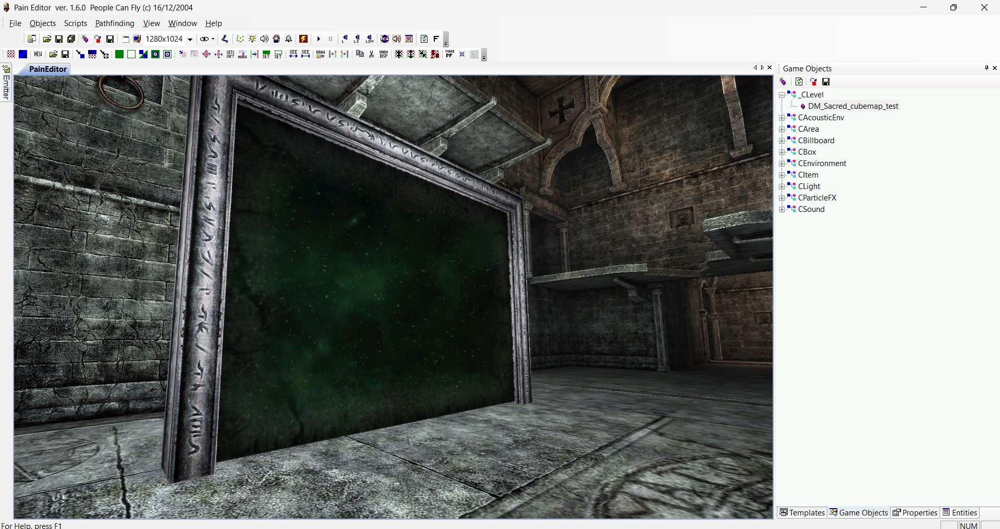

## Painkiller cubemap shaders

Painkiller cubemap shaders for teleports work in a way that cubemap will always face the direction you generated it for. It means that various teleports in various positions will see different cubemap sides of the same cubemap. Look at it as if cubemap is around the whole level and not just inside the teleport.

!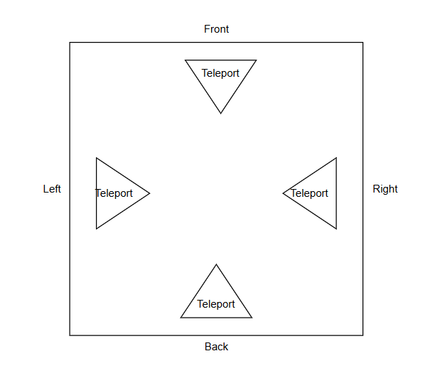

Thus, sometimes you will have to rename, rotate, and flip the cubemap layers to see the desired image side. In GIMP, **Layer** -> **Transform** menu.

Example when you need to rotate the cube through 180 degree. Use these parameters:

!!! Note
    X+ left;
    X- right;
    Y+ top (rotate by 180 degree);
    Y- bottom (rotate by 180 degree);
    Z+ back;
    Z- front

The result:

!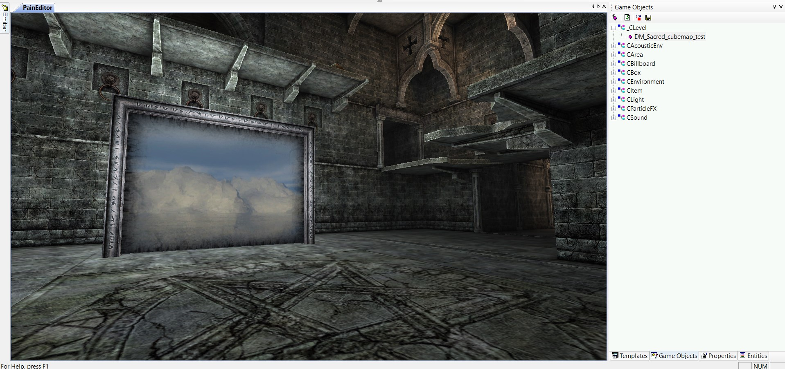

## Free skyboxes

<https://www.humus.name/index.php?page=Textures&start=0>

<https://github.com/sheraadams/OpenGL-Skyboxes-and-Photoshop-tutorial/tree/main/Skyboxes>

<https://www.slipseer.com/index.php?resources/makkon-skyboxes.139/>

<https://lvlworld.com/download/id:2023>

AI skyboxes, when you try to download a skybox from blockadelabs which is not fee, it'll allow you to download a free sample pack:

<https://skybox.blockadelabs.com/>

## References

<https://www.reddit.com/r/opengl/comments/18zfenj/best_place_to_get_realistic_space_skybox_textures/>

<https://jaxry.github.io/panorama-to-cubemap/>

<https://mikletuapse.itch.io/space-skybox-generator>

<http://alexcpeterson.com/spacescape/>

<https://www.nutty.ca/webgl/skygen/>

<https://docs.unity3d.com/Manual/class-Cubemap-create.html>

<http://www.c-jump.com/bcc/common/Talk3/OpenGL/Wk13_skybox/Wk13_skybox.html>

<http://www.3dcpptutorials.sk/index.php?id=24>

<https://www.ogldev.org/www/tutorial25/tutorial25.html>

<https://www.khronos.org/opengl/wiki/Cubemap_Texture>

<https://learnopengl.com/Advanced-OpenGL/Cubemaps>