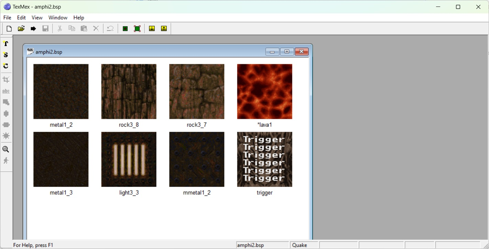
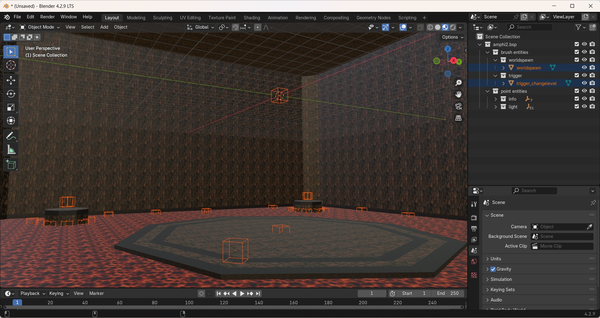
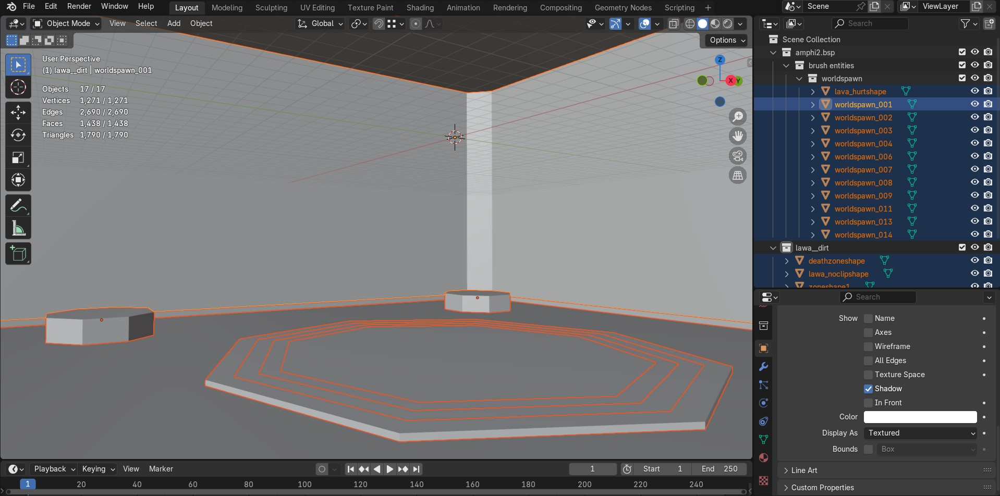
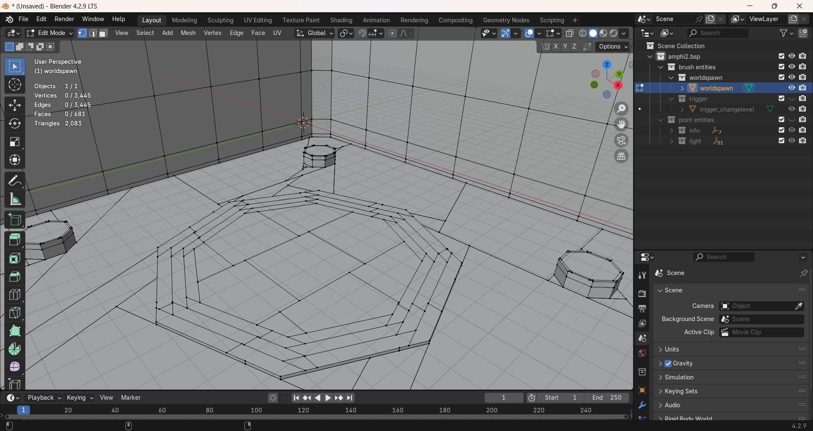
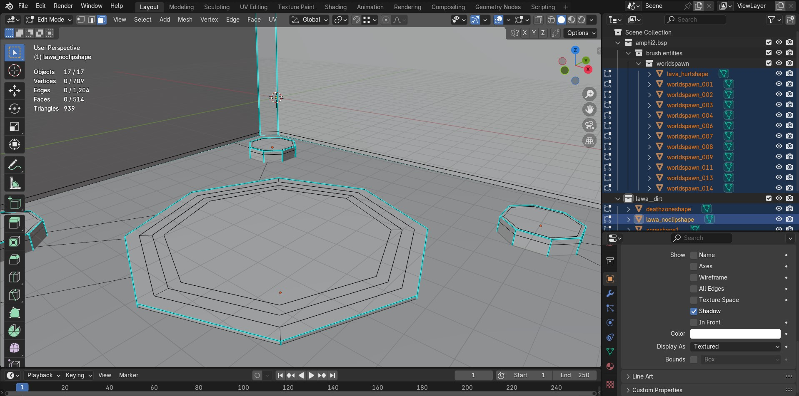
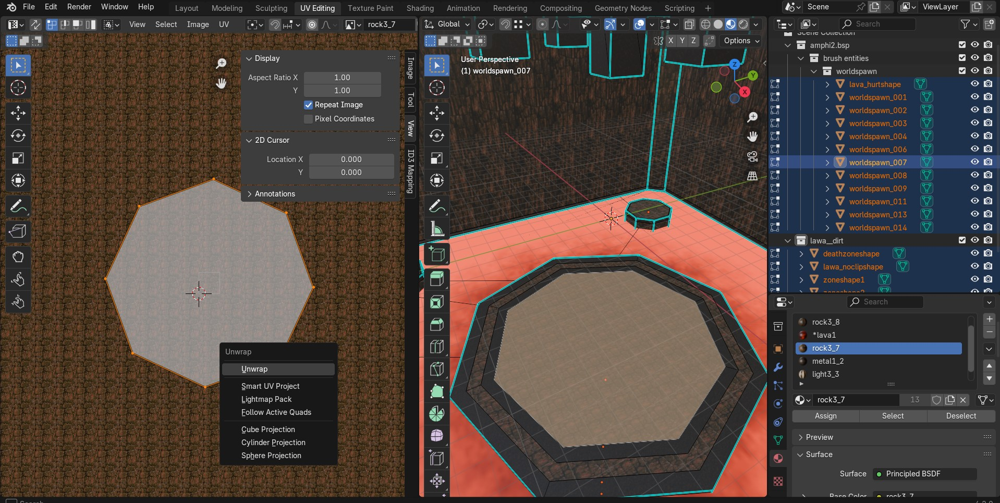
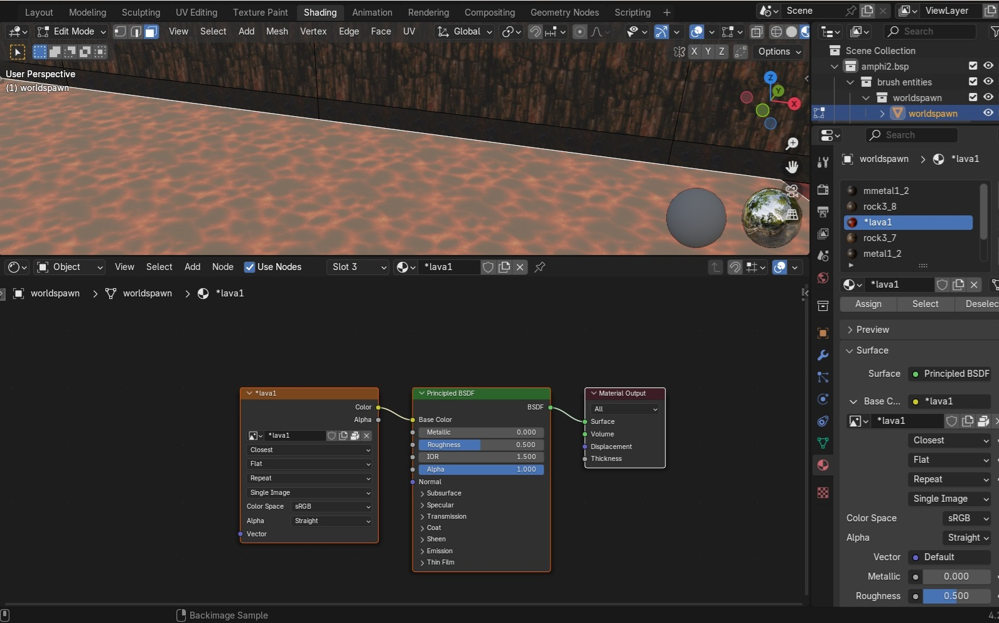
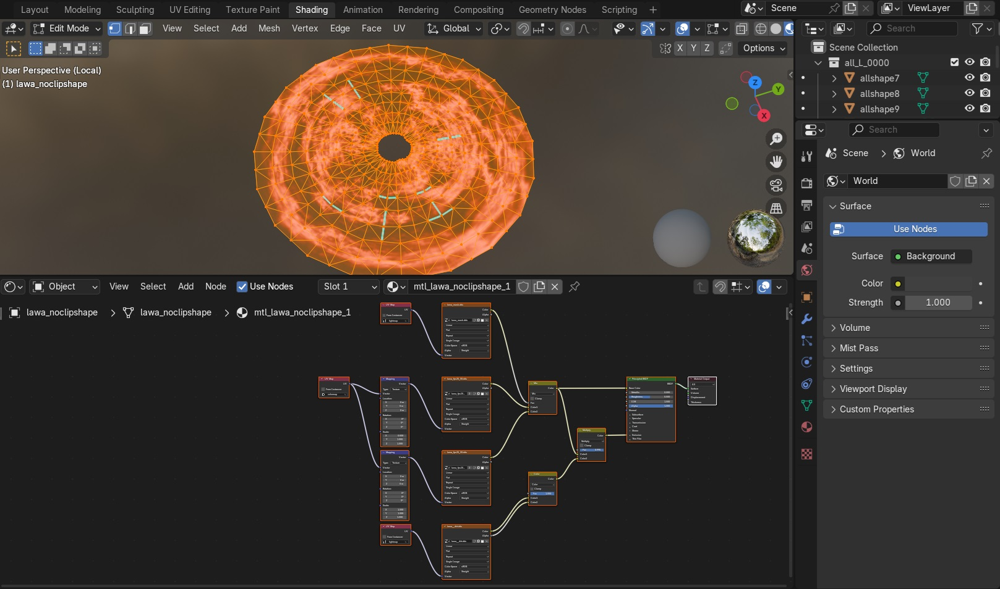
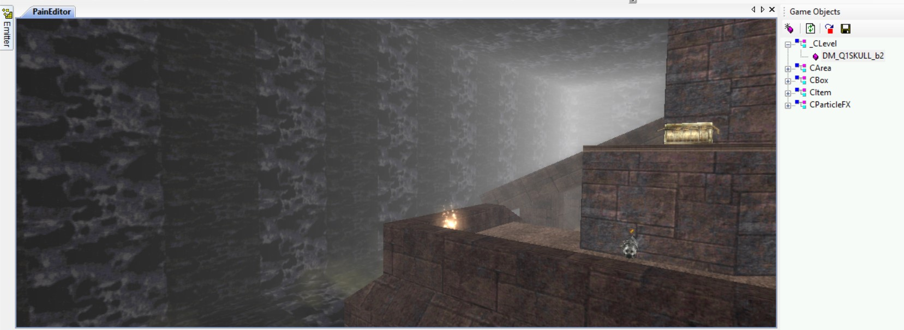
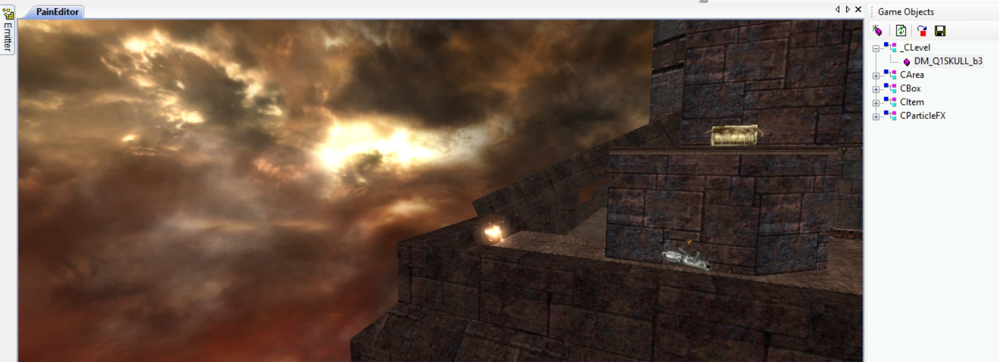

# Port Quake 1 maps to Painkiller

!!! Note
    Don't forget to install the [**Blender MPK plugins**](../mapping/blender-mpk-plugins.md) first.

Quake 1 has a pretty big roster of high quality custom singleplayer and multiplayer maps. First community attempts to port Quake 1 maps were right after the Painkiller release [**reference**](https://www.pkeuro.net/modding/).

Nowadays, we have amazing Blender Quake 1 plugins that solve a lot of conversion issues.

! from Arcane Dimensions mod")

!!! Warning
    I recommned contacting the original Quake 1 map owners before porting a Quake 1 map to Painkiller. The mappers are usually around in the Quake 1 discord channels.

## Configure Quake 1

!!! Note
    Quake 1 and Quake World is basically the same game. Quake World is a multiplayer update for Quake 1. If you hear Quake World references it usually means Quake 1 multiplayer.

It's not mandatory to have a full Quake 1 game to work with its maps. However, I higly recommend a full game with all the sounds and music so that you were able to completely immerse in a map that you are going to port.

1. Purchase the game on Steam or GOG.

2. Install [**Ironwail**](https://github.com/andrei-drexler/ironwail/releases) or [**vkQuake**](https://github.com/Novum/vkQuake/releases).

3. Configure [**music**](https://steamcommunity.com/sharedfiles/filedetails/?id=2234753899)

Alternatively, you can download [**nQuake**](https://nquake.com/) which is based on the shareware Quake 1 and only focused on multiplayer. That version does not have map sounds and does not support music.

Custom maps are installed in `..\Quake 1\ID1\maps`. Custom [**skybox textures**](https://www.slipseer.com/index.php?resources/makkon-skyboxes.139/) (mosly Makkon skyboxes are required) are intalled into `..\Quake 1\ID1\gfx\env`.

## Introduction

Quake 1 maps have two formats: `MAP` and `BSP`.

- MAP is a human readable text source saved from the Quake editor, like [**Trenchbroom**](https://trenchbroom.github.io/). This format has the complete map geometry, clip brushes (invisible walls) information, and more. The map textures are shipped separately via the `.wad` files.

- BSP is a compiled map by the Quake compiler. A single BSP file contains the map itself, its textures, and a lightmap.
The geometry in BSP is cut and cleaned by the compiler, all the unnecessary parts are removed. BSP files can be read by the [**Quake 1 BSP Editor**](https://www.bspquakeeditor.com/).

It's rare to find map sources in a `MAP` format with its accompanied `WAD` texture file. Most Quake 1 maps on the intertnet can be found in the compiled `BSP` format. From the map porting perspective, BSP is what we really need. It has relatively clean geometry and all the resources within the BSP file. However, as mentioned above, the MAP format has more information which BSP decompilers can't retrieve, like invisible walls aka clip brushes so, ideally, it's better to have BSP alongside with MAP. Otherwise, you'll have to throughly check the map gameplay in Quake before porting.

Another issue, regardless of MAP or BSP, Quake 1 maps are created with brushes. Simply put, a brush is a cube. When you check a Quake 1 map in a 3D editor within the "Edit" mode, you'll notice that it has a lot of unnecessary verticies, edges, and polygons. Each vertex will create an additional triangle. All of these are not very good for PainEngine and can cause FPS drops so it's necessary to clean the geometry as much as possible and optimize a map using PainEngine zones, portals, and anyps.

It is necessary to mention that Quake 1 maps use a lot of moving objects, like traps, lifts, moving platforms which Painkiller is missing. You will have to use some workarounds to make those work in Painkiller. 

Apart from that, Quake 1 uses various animated textures with special characters in the beginning. Painkiller has shaders which can animate textures so you will need to rework some object materials to fit for Painkiller. You will also need to remove the special characters from the texture naming or they won't work in Painkiller.

## Map archives

[**Quaddicted singleplayer and multiplayer map archive**](https://www.quaddicted.com/)

[**Quaddicted Files**](https://www.quaddicted.com/files/)

[**Slipseer singleplayer maps**](https://www.slipseer.com/)

[**Quake 1 MAP sources released by John Romero**](https://github.com/fzwoch/quake_map_source)

[**Quakeworld NU recommended multiplayer maps**](https://www.quakeworld.nu/wiki/Category:Maps)

[**Quakeworld NU multiplayer map archive**](https://maps.quakeworld.nu/all/)

[**Project Q1Q3**](https://github.com/mickkn/projectq1q3)

[**QRack multiplayer map archive**](https://quakeone.com/qrack/maps/)

## BSP and WAD texture export

!!! Note
    PainEngine only supports bmp, tga, dds images.

The recommended tool for exporting textures from Quake Wad and BSP files is [**TexMex**](https://valvedev.info/tools/texmex/).

1. Open a Quake 1 WAD or a BSP file file.

    !

2. Click `File` -> `Export` and choose `Tga24` which is more compressed or `Bmp`.

3. Copy the textures that have special symbols in them, like in '*lava1', and rename them without special characters like in 'lava1'.

4. Replace textures with the same name from the HD [**restoration project**](http://qrp.quakeone.com/). These are the high quality textures that are faithful to the original. Alternatively, you can try [**Makkon texture pack**](https://www.slipseer.com/index.php?resources/makkon-textures.28/) or even replace them with the original Painkiller textures.

## BSP Import

BSP Import is the preferable way of working with Quake 1 maps.

The textures are already packed within BSP so you don't need to use additional folder for textures.

!!! Warning
    Some custom Quake 1 maps that use increased limits and new versions of BSP cannot be open by the plugin.

!!! Note
    The BSP plugins below have Quake 1 lightmap support; however, this functionality is bugged and the lightmap coordinates are broken. The developers made this lighmap feature disabled and hidden by default. Let's see if they fix this feature in the future updates. As of now, the maps can only be exported without lightmaps and you'll have to generate ones youself.

1. Install one of these Blender plugins or you can even install them both. I find both of them great with its pros and cons:

    - [**Quake 1 BSP importer by joshuaskelly**](https://github.com/joshuaskelly/io_scene_bsp)
    - [**Quake 1 BSP importer by andyp123**](https://github.com/andyp123/blender_io_mesh_bsp)

2. Once you installed and enabled the plugin in the Blender preferences, go to `File` -> `Import` -> `Quake BSP (.bsp)`.

3. The map is imported as one `worldspawn` object. You will notice that the importer also adds some redundant map information, like lighting, spawn points, triggers. Examine them and don't forget to remove those from your final map version.

    !

4. Go to the `Edit` mode (Tab) and separate the geometry by materials: press `P` -> `By Material`. You'll need to separate because it's not good for the PainEngine to load such a big map object altogether. There should be a ballance between the quantity of the objects and a number of triangles. From the PainEngine official documentation: "Single mesh can have up to 20000 triangles. Whole level scene can have up to 4096 objects but it is reasonable to keep no more than a couple of hundred objects." Here is the example of how I separated the map objects on "amphi2":

    !

5. Go back to the object mode and select all the meshes that were separated by material. Enter the Edit mode again, select all `A`, click `M` -> `By Distance` (Merge distance 0.0001 m) to merge the verticies, then `X` -> `Limited Dissolve` to clean the meshes from the unnecessary verticies and edges. This is recommended for the engine and it also improves texturing and object shading. This should be done after the separation by material and vertex merge. It requires you to have experience with Blender because features as vertex merge, limited dissolve, snap utility can be very destructive and requires high attention. Always enable statistics to see how the result was improved. Examine thoroughly all the meshes in the edit mode after such operations, delete manually remained unnecessary verticies and edges. Check the difference on the examples below, the geometry before and after the cleaning; I removed about 75% of redundant verticies on such a small map:

    !

    !

6. Once you cleaned the geometry, you need to fix the texture coordinates (unwrapping) on all the modified objects:

    !

7. Go to the Object mode and fix the shading for all the map objects. Select them all, click the right mouse button and choose "Shade Auto Smooth" by 30 or 45 degree. For terrain and statues, I prefer 60 degree but it's a matter of preference and how it looks in the editor.

8. Go to the material properties where the textures have a special character. Replace it with the texture without a special character in its name, the one you made before if you followed this tutorial: 

    !

9. Change some objects like water, lava, acid according to how it's done in Painkiller maps. It's possible to change a lava texture but you need to follow a pattern. For example, a lava object on DM_Fallen1 looks this way (mind the grid, texturing, and mesh properties in Blender and in the MapEntities in CLevel) and you can import it with its material right in a Quake 1 map port:

    !

10. Remove "fake" sky on the map. Quake 1 maps are always enclosed rooms with or without skyboxes. Painkiller uses skydomes and this is a different technology so you need to remove the Quake 1 boxes with animated sky textures from the map, if they are present to improve the visuals. Check the difference between a map with the "fake" sky and after its removal and the ported map "skull":

    !

    !

11. Add Painkiller barriers, ladder zones, steps with additional barriers, optimize the map for Painkiller movement.

12. Add zones, portals, antyp to optimize the map performance.

13. Find solutions to Quake 1 lifts, planforms, traps using Painkiller DAT objects and scripts. Modify or remove some Quake 1 objects that do not work in Painkiller.

14. Export the MPK file with the Blender Painkiller plugins and check the map in PainEditor. It's high likely, you will need to scale the map with `o.Scale` in CLevel (`o.Scale = 0.3` is default in Painkiller). Thoroughly check if there are any map holes, amend them with the Blender snap tool.

15. When the map is ready, generate lightmaps with the Blender [**Lightmapper addon**](https://github.com/Naxela/The_Lightmapper).

## Map format import and export

In case you need to work with the Quake 1 `.map` file, there are 2 Blender plugins:

[**Quake MAP File Importer by andyp123**](https://github.com/andyp123/blender_io_mesh_qmap?tab=readme-ov-file)

[**MAP File Exporter**](https://github.com/c-d-a/io_export_qmap)

## WRL Import

It's a rare case, most likely you won't need this. The BSP file can be converted to WRL using [**bsp2wrl**](https://dukeworld.duke4.net/idgames2/utils/level_edit/converters/) then it can be imported with the [**Web3D X3D/VRML2 format**](https://extensions.blender.org/add-ons/web3d-x3d-vrml2-format/) Blender addon.

## Noesis

A couple of words of [**Noesis**](https://richwhitehouse.com/index.php?content=inc_projects.php&showproject=91), it's a good program, can import Quake 1 BSP files with lightmaps. However, I was not satisfied with the result of how it exported a map via FBX format. The map looked quite broken in Blender after Noesis.

## Additional links
<https://github.com/ericwa/ericw-tools>

## Quake 1 discord channels
<https://discord.gg/quake-world-166866762787192833>

<https://discord.gg/WkBX6NG5Ym>

<https://discord.gg/SWrfsYJqsu>

<https://discord.gg/sxEVGWBFzJ>
