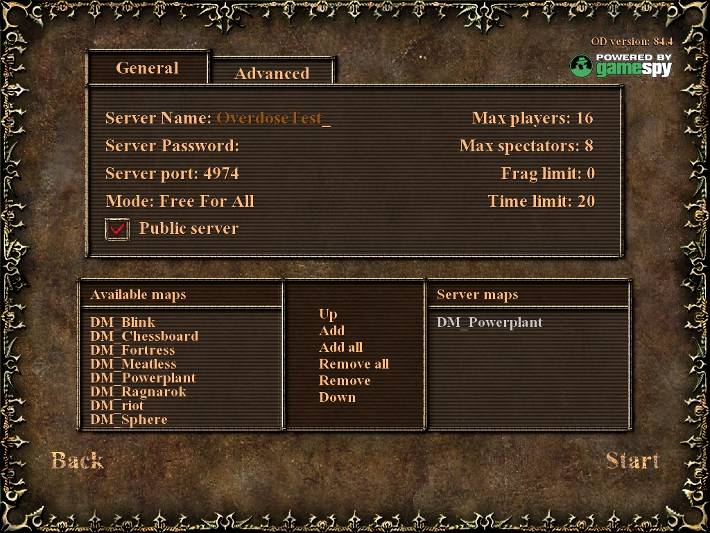
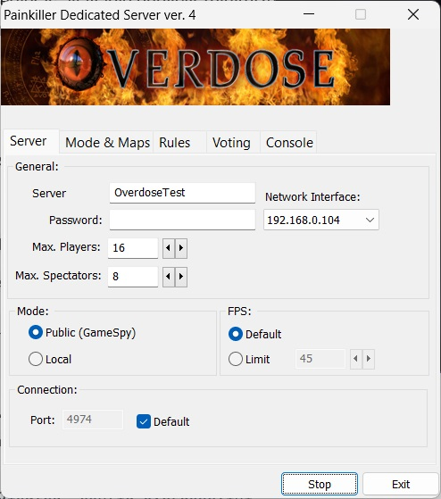
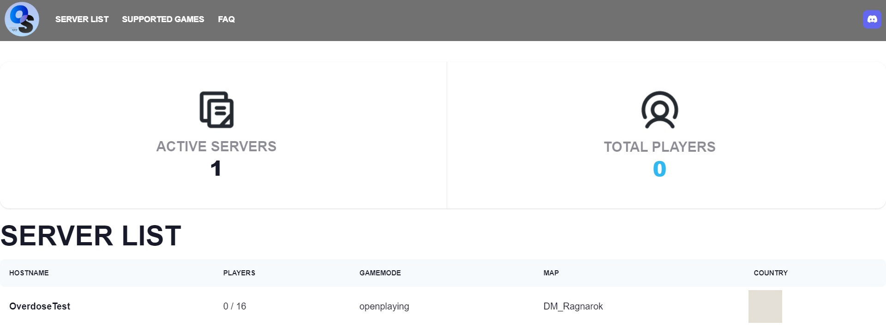
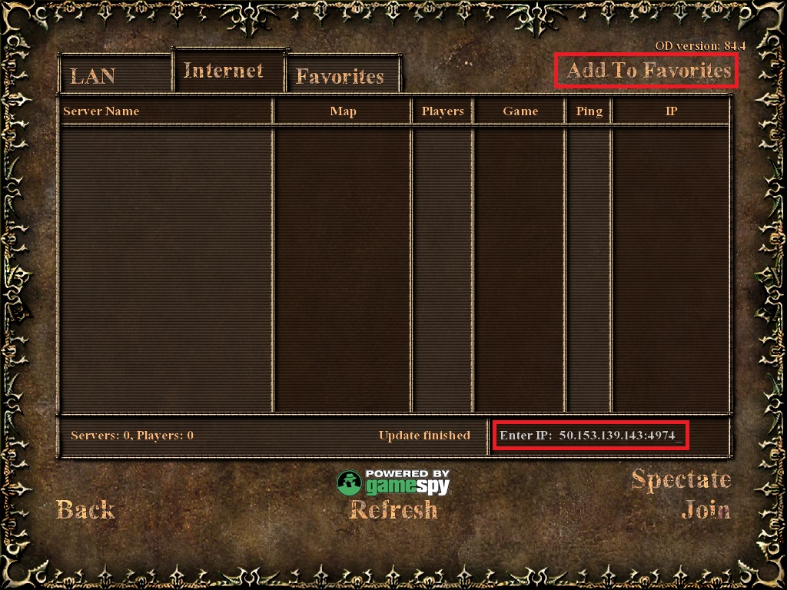
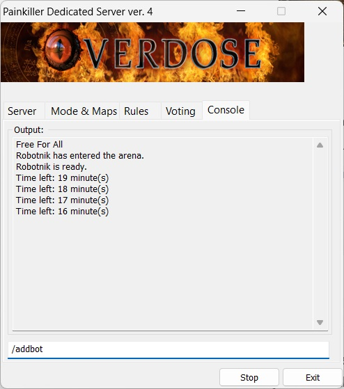

# Setup Painkiller Overdose Windows server

Painkiller Overdose does not have an official Linux server so it's only possible to host a server on Windows. This is one of the reasons that no one hosts servers for this game nowadays.

This guide will give you step-by-step instructions on how to set up the Painkiller Overdose Windows server and play with your friends.

Here is a brief description of the game releases. The official international versions of the game were:

- 66.2 [Demo](https://www.moddb.com/games/painkiller-overdose/downloads/painkiller-overdose-single-and-multiplayer-demo)
- 75.3
- 84.4

These are the only recommended versions to host your server.

There also were several versions in-between 75.3 and 84.4 from the local publishers but the additional singleplayer and multiplayer game content was only introduced in 84.4.

This unofficial version of the [**patch**](https://www.moddb.com/games/painkiller-overdose/downloads/painkiller-overdose-patch-753-to-84) will upgrade your game to 84.4 from 75.3 and it already incorporates the Gamespy fix.

It's also worth mentioning the competition multiplayer mod called [**PROverdose**](https://www.moddb.com/mods/proverdose-mod-for-painkiller-overdose) made by OriOn and PrimeviL which was intended to be similar to PK++ for the original Painkiller.

## Windows Server Setup

The server setup includes the following steps:

* Router configuration
* Windows Firewall configuration (optional)
* OpenSpy configuration
* Server launching
* PROverdose setup (optional)
* Custom Mappack (optional)

### [Router configuration](router-config.md)

If you use a router, you need to forward a port to the Overdose server. The game's default port is `4974` but you can change it to another one. I highly recommend reserving a local IP address for this purpose. Please refer to this [**guide**](router-config.md) for more information on the router configuration.

I'll take the local IP `192.168.0.104` in further examples.

### [Firewall configuration](od-firewall-config.md)

This step is not always required. In my case, all worked without this configuration. However, you may need to create firewall inbound and outbound rules for the game via TCP and UDP protocols. Refer to this [**information**](od-firewall-config.md) for more details.

### [GameSpy to OpenSpy](gamespy-openspy.md)

GameSpy was a server browser for online games. A public game server could advertise its IP address to GameSpy master servers and all clients could see it in the browser list. GameSpy also checked the game CD key and prevented the clients with bogus keys from joining a server.

GameSpy was shut down in 2013 and since then the community created its open-source clone OpenSpy.

OpenSpy does not have any CD key checks during the online play. However, a game may have its own CD key validation. The international version of Painkiller Overdose did not have any CD key validations.

To use OpenSpy, you can either replace all instances of **gamespy.com** with **openspy.net** in `OverdoseEngine.dll`, `OverdoseEngineEditor.dll`, `OverdoseEngineServer.dll` or modify the Windows `hosts` file.

This [guide](gamespy-openspy.md) will give you more detailed information on how to do it.

### Server launching

There are several ways to run a public server:

* In-game public server
* Dedicated server
* Dedicated console server

#### In-game public server

The important thing here is to run the game with the correct network interface.

In the previous examples, I ran a server on `192.168.0.104` thus I need to pass this parameter to the game because it may try to run the game under a different interface.

1. Create a Windows shortcut or a BAT file in the `..\Overdose\Bin\` directory with this content:

    ```
    Overdose +interface 192.168.0.104
    ```

    Additionally, for your convenience, copy `C:\Users\%USERNAME%\AppData\Local\Painkiller Overdose\Overdose.ini` to `..\Overdose\Bin\` and rename it to `OverdoseServer.ini`. Add the following parameters:

    ```
    Overdose +interface 192.168.0.104 -config OverdoseServer.ini
    ```

2. Run the game via that file and select `Multiplayer` -> `Start Game` -> Tick `Public Server`, make the necessary configurations, and `Start` the public server.

    !

    To check if the server is available publicly, minimize the game and after some time the server will be present on this [**page**](http://beta.openspy.net/en/server-list/painkillerod). It means that a client should be able to see it in his in-game server list provided they also made modifications regarding OpenSpy on their side.

#### Dedicated server

It is similar to the steps above but we'll run a server via a different program.

1. For your convenience, copy `C:\Users\%USERNAME%\AppData\Local\Painkiller Overdose\Overdose.ini` to `..\Overdose\Bin\` and rename it to `OverdoseServer.ini`.

    Let's modify `OverdoseServer.ini` and change WarmUpTime and MaxFpsMP:

    ```
    Cfg.WarmUpTime = 0
    Cfg.ServerFPS = 45
    Cfg.MaxFpsMP = 125
    ```

2. Create a Windows shortcut or a BAT file in the `..\Overdose\Bin\` directory with this content `OverdoseDedicated.bat`:

    ```
    Overdose -dedicated -config OverdoseServer.ini
    ```

3. Open the server via that file and select the `Network interface` to which you forwarded traffic from your router (`192.168.0.104` in my example); select the `Public(GameSpy)` mode. Make the necessary configurations and click `Start`.

    !

    After some time, the server should be present on this [**page**](http://beta.openspy.net/en/server-list/painkillerod)

    !

4. Clients should see your server and will be able to join provided they also made modifications regarding OpenSpy on their side. However, you will not be able to see your server on the in-game list or you'll see it as a broken server and if you try to join it, you'll get an error that this IP does not respond. It seems that the game was implemented in a way that a server can only be seen from a different external IP.

    So you need to type in manually in the game to join the server either via the internal IP address `192.168.0.104:4974`or via the external one `50.153.139.143:4974` and add to `Favourites` for your convenience.

    !

    Then you will be able to find your server on the `Favourites` tab and join it from there.

5. As a server administrator, you can use all console commands via the `Painkiller Dedicated Server` GUI menu. Let's add a bot to the server session. Click the `Console` tab and type in the following command and hit `Enter`:

    ```
    /addbot
    ```

    !

    You will not be able to use all console commands if you join a server as a client and run commands via the in-game console.

6. `Stop` or close the server when you decide to close the multiplayer session.

#### Dedicated console server

The dedicated console server `OverdoseServer.exe` doesn't have any command line options and can only be run with the default options, thus it is not recommended.

## PROverdose server (optional)

PROverdose is a competitive mod. Its server is compatible with the original Overdose and PROverdose so the client doesn't need to have this mod installed but the client still needs to have the OpenSpy fix.

1. Download the [**PROverdose**](https://www.moddb.com/mods/proverdose-mod-for-painkiller-overdose) mod. PROverdose 0.4 only supports the latest official Painkiller Overdose v84.4. Earlier versions of PROverdose support Painkiller Overdose v75.3 and lower.

2. Extract the archive's content to your `..\Painkiller Overdose\Data` directory.

3. For your convenience, copy `C:\Users\%USERNAME%\AppData\Local\Painkiller Overdose\Overdose.ini` to `..\Overdose\Bin\` and rename it to `OverdoseServerPro.ini`.

4. Create a Windows shortcut or a BAT file in the `..\Overdose\Bin\` directory with this content `OverdoseDedicatedPro.bat`:

    ```
    Overdose -dedicated -lscripts PROverdose.pak -config OverdoseServerPro.ini
    ```

5. Run the server via that file.

## Install custom multiplayer mappack (optional)

Recommended additional maps can be downloaded [**here**](https://www.moddb.com/games/painkiller-overdose/addons/classic-pk-multiplayer-maps-for-overdose)

Copy the files to `C:/Painkiller Overdose/Data/`.

## Possible errors

```
Net init error: Failed to find socket on port 4974: WSAEADDRNOTAVAIL
```

It is possible that you ran the in-game public server with the `+interface` command so make sure the local IP address exists.

```
Net Error: Given address does not reply
```
Try joining the server manually via the external IP or without indicating a port if it's a default one.

```
GameSpy timeout error!!!
Description: No challange value was received from the master server
```
Make sure you use the interface where the traffic was forwarded to when running the game.
