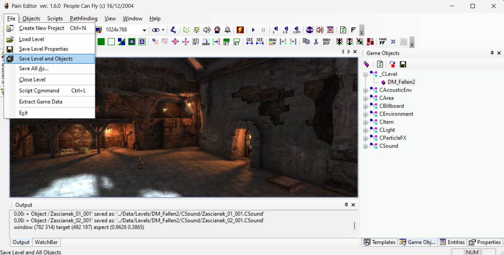
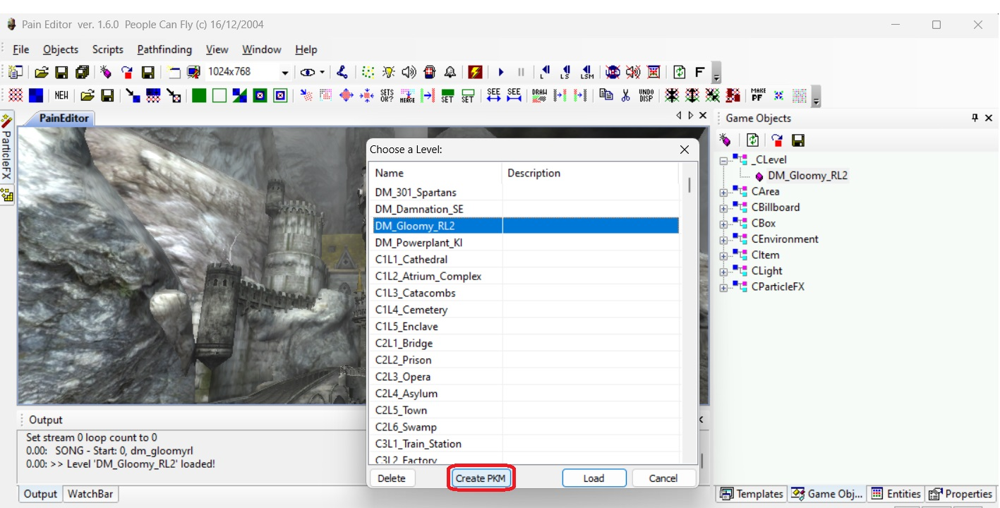
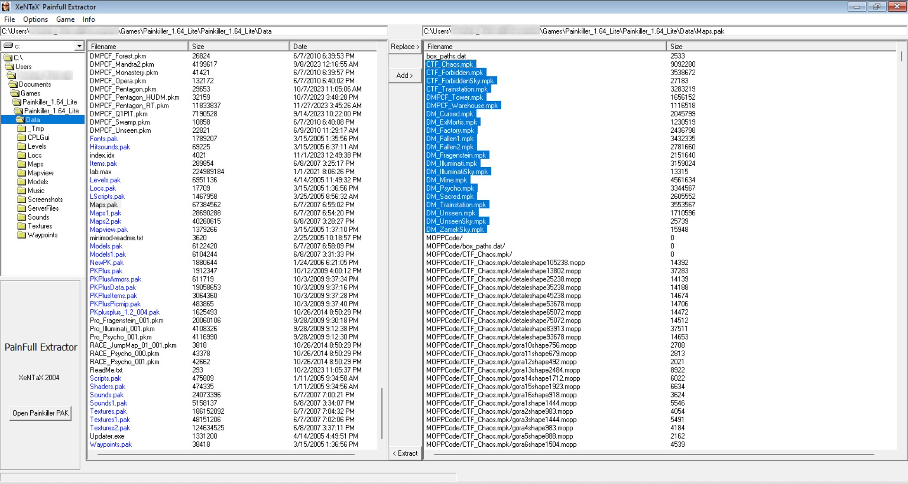
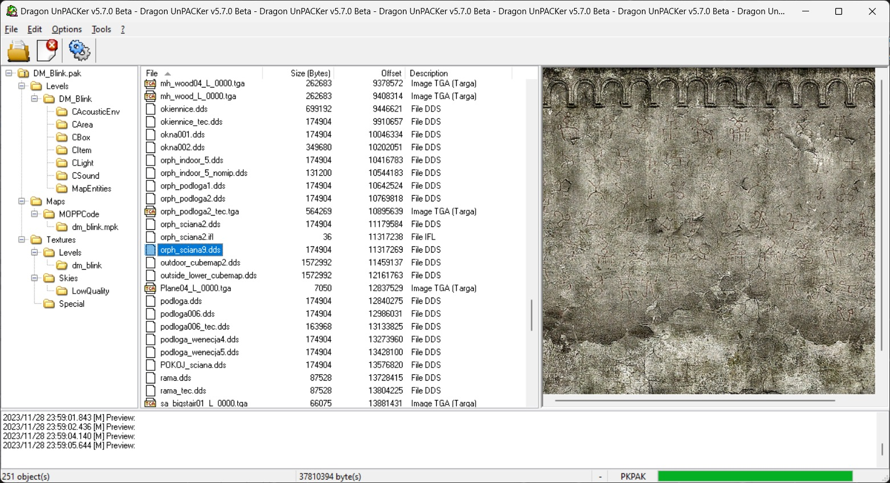
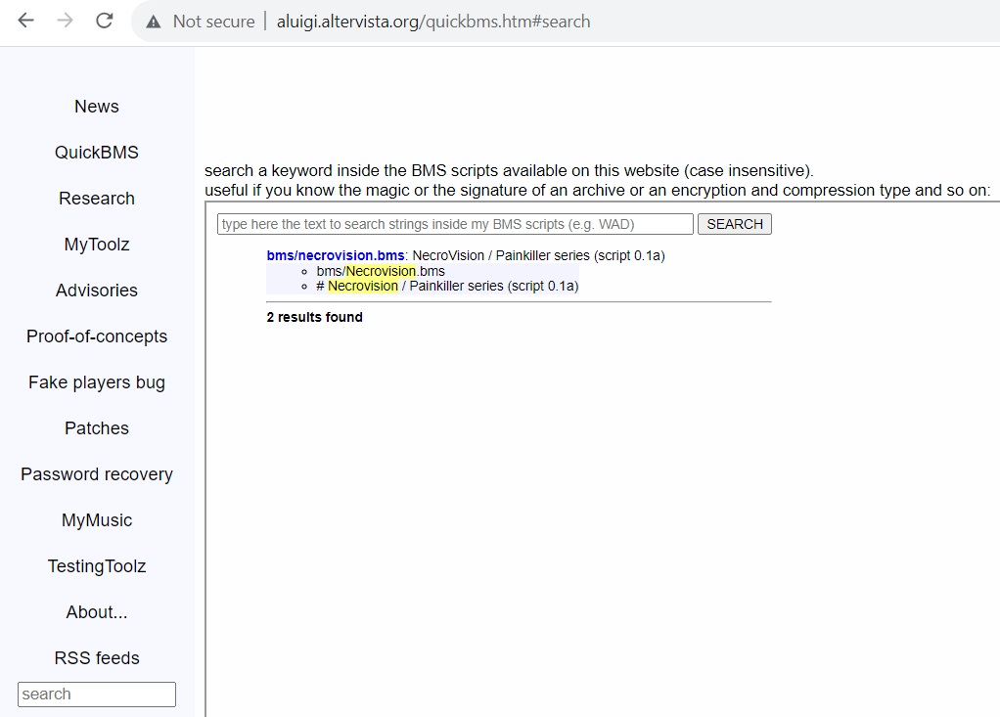

# Unpack and Pack Painkiller/Necrovision game resources

> Painkiller has two types of package formats: **.pak** and **.pkm**.

These are basically the same types of archives with the difference that **.pkm** files are loaded by the game automatically during start and **.pak** must be registered for the game to load.

Custom multiplayer maps are usually packed with the **.pkm** extension.

!!! Notes
    Don't confuse **.pkm** archive format with the **.mpk** geometry binary file. 

    The geometry **.mpk** file can be opened in Autodesk 3ds Max using this unofficial [plugin](https://www.moddb.com/games/painkiller/downloads/painkiller-3ds-max-plugins-upd270522).

#### Tools to unpack Painkiller/Necrovision game resources

* Built-in game tools using **FS.ExtractPack** (the most recommended option)
* Painkiller standard editor **PainEditor** (it can extract .pkm maps partially but is not recommended for this purpose)
* [PainFull Extractor](https://www.moddb.com/games/painkiller/downloads/painfull-extractor-v132) program (outdated; no source code)
* [PainKillerExtractor](https://github.com/t3r6/painkiller-extractor) program (outdated; source code available)
* [Dragon UnPACKer](https://www.elberethzone.net/dragon-unpacker.html) (open source)
* [QuickBMS](http://aluigi.altervista.org/quickbms.htm) (open source)

#### Tools to pack Painkiller/Necrovision game resources back

* Built-in game tools using **FS.CreatePack** (recommended option for **.pak** archives)
* Painkiller standard editor **PainEditor** (recommended option for maps **.pkm** files)
* [PainFull Extractor](https://www.moddb.com/games/painkiller/downloads/painfull-extractor-v132) can add and replace files in a package (not recommended).
* [QuickBMS](http://aluigi.altervista.org/quickbms.htm) can re-import files to a package (not recommended).

## Built-in game tools

People Can Fly video game development studio provided tools for unpacking and packing resources.

!!! Notes
    This is the most reliable and recommended way to pack and unpack Painkiller resources. I also recommend using **PainEditor** to package map **.pkm** archives.

### Unpack

Unpack files from .pak or .pkm archive via CLI:

**Powershell** (can accept relative path to the output file):

```psh
.\painkiller.exe -script FS.ExtractPack"('../Data/DM_Test.pkm','../../Test')"
```

**Windows cmd** (need to indicate full path to the output file):

```cmd
.\painkiller.exe -script FS.ExtractPack('../Data/DM_Test.pkm','C:/Users/User/FullPath/Games/Painkiller/Test')
```

### Pack

To pack files back to the .pak or .pkm archive via CLI:

`true` is for compression.

**Powershell** (can accept relative path to the output file):

```psh
.\painkiller.exe -script FS.CreatePack"('../Data/DM_Test.pkm','../../Test',true)"
```

**Windows cmd** (need to indicate full path to the output file):

```cmd
.\painkiller.exe -script FS.CreatePack('../data/MyPack.pkm','path/to/files/',true)
```

## PainEditor (default Painkiller Editor)

PainEditor comes with the Painkiller game. It's located in **..\Painkiller\Bin\Editor**.

### Export all game data

!!! Warning
    This method will hang your PainEditor for several minutes and extract all files from all **.pak** archives to the current folders in the ..\Data directory.

To export all game data resources, click **File** -> **Extract Game Data**.

### Export a map

!!! Warning
    PainEditor does not extract some map resources and **..\Data\Levels\MapEntities** with this method. MapEntities usually include cubemaps for portals and water shaders. Moreover, PainEditor will not extract other map resources, like the geometry **.mpk** file, Textures, level scripts for Singleplayer maps, etc. It was a common mistake in the past that many mappers did not include portal textures on their maps because of that. Thus, be aware to copy those manually if needed or extract all map resources using a different method. So, generally, it is not recommended to extract maps and resources with PainEditor.

To export a map with the editor, follow these steps:

* Click on **File** -> **Load Level** and choose the level you'd like to export.
* Once the level is opened, click **File** -> **Save Level and Objects**

After that, the extracted map files will appear in the **..\Data\Levels** directory.

!

### Pack a map to .pkm

* Place all your map resources into the <b>..\Painkiller\Data\</b> directory.
* Open your map in the editor by clicking on **File** -> **Load Level** so that the game generates sort of a cache [MOPPCode (memory-optimized partial polytope)](https://www.gamedeveloper.com/pc/havok-1-6-includes-new-mopp-technology) in the <b>..\Painkiller\Data\Maps\MOPPCode\</b> directory.
* Then save the map by clicking on **File** -> **Load Level**, click on the Level you want to pack and click **Create PMK**.

It will create a **.pkm** file inside the <b>..\Painkiller\Data\</b> directory.

!

## PainFull Extractor

!

PainFull Extractor was released in 2004 as a side project of MultiEx Commander by Mike Zuurman aka Mr.Mouse/XeNTaX. Latest Version 1.3.2.

This unpacker supports **.pak** and **.pkm** archives but cannot unpack some archives with zero-byte files in <b>..\Painkiller\Data\Maps\MOPPCode\</b> which is common in Painkiller Resurrection. Also, it has several annoying bugs like errors during the folder navigation, instability. This program is considered outdated but it's still widely used.

You can get the program [here](https://www.moddb.com/games/painkiller/downloads/painfull-extractor-v132).

You need to run PainFull Extractor in a [Windows XP compatibility mode](https://www.computerhope.com/issues/ch001894.htm) as administrator.

### PainFull Extractor Guide

Taken from the official `readme.txt` manual.

Just browse to a PAK file of your choice at the left side of the tool, select it in the file list, and hit **Open Painkiller PAK**. You will notice the contents (entries) listed to the right.

* Extraction

    Just select all files at once, clicking on the top file first followed by a click on the last while holding down the `shift` button. Alternatively just select the files you want, by holding `ctrl`.

    To extract, click the button below and in between the two lists, with `<<` on it. Voila. It will extract the files into the current path.

* Addition

* Replacement

    Select a file in the file list that you want to use to replace a file in the open archive. Second, select the file you wish to replace in the contents list. Click the `>>` button, and wait until it's finished. Done.

    !!! Warning
        PainFull will automatically import the new file, and will NOT create a backup. If you want to mess around with any PAK file, be sure to back it up first and store it somewhere safe!

## PainKillerExtractor

PainKillerExtractor was released in 2004 by Andrew Frolov aka FAL.

The tool and the source code itself are located in this [repository](https://github.com/t3r6/painkiller-extractor). This unpacker sometimes fails to extract correctly from an archive but it should be OK for modifying multiplayer maps. The tool basically consists of the `PainKillerExtractor.exe` file and everything else is a source code.

### PainKillerExtractor Guide

!!! Note
    Be sure to place `PainKillerExtractor.exe` with the file you want to extract in a separate folder so that the extraction will not mess the files in your current folder.

* Unpacking by drag-and-drop

    You can simply drag and drop the **.pak** or **.pkm** archive to this application (drag the .pak archive with the mouse cursor to the .exe file) and it will unpack the resources automatically.

    !

* Unpacking via CLI

    ```psh
    .\PainKillerExtractor.exe PKPlus.pak
    ```

## Dragon UnPACKer

[Dragon UnPACKer](https://www.elberethzone.net/dragon-unpacker.html) is an open-source tool for unpacking game resources. Currently, it supports Painkiller **.pak** files but cannot unpack **.pkm** by default. To unpack **.pkm** files with Dragon UnPACKer you need to temporarily rename **.pkm** file to **.pak**. For example, rename `DM_Blink.pkm` to `DM_Blink.pak` and Dragon UnPACKer will allow you to extract `DM_Blink.pak` resource in this case. Sometimes this program can break files during extraction but it's a very good program to browse in-game packed resources.

!

## QuickBMS

[QuickBMS](http://aluigi.altervista.org/quickbms.htm) is an open-source tool for unpacking game resources. QuickBMS is a complex tool with a lot of capabilities so I'll cover it briefly. If you want more details, read their manual in the `quickbms.txt` file.

### Start with QuickBMS

* Download the program from the [website](http://aluigi.altervista.org/papers/quickbms.zip).
* Extract the QuickBMS archive.
* QuickBMS uses plugins to extract game resources and we'll need to download one. Go to [BMS Search](http://aluigi.altervista.org/quickbms.htm#search) on their website and search using Necrovision or Painkiller keywords. Download the `bms/necrovision.bms` script and put it in the QuickBMS folder.

!

### Unpack game archive

* Run `quickbms.exe` as an administrator.
* Select the `necrovision.bms` plugin.
* Choose **.pak** or **.pkm** file to extract. You can also select all the archives in the folder to be unpacked by indicating asterisk (`*`) as a **File name** or use regex.
* Choose the folder where to extract

### Reimport to game archive

The idea consists of being able to reimport ("injecting back") the modified files in the original archives. Though, I don't recommend using this option.

* Make a backup copy of the original archive.
* Extract the files or only the ones that will be necessary for modification.
* Modify the extracted files leaving their size unchanged or smaller than before.
* Reimport the files in the archive via `reimport.bat` or `reimport2.bat` if the former gives errors. Administrator mode is not required.
* Open `reimport.bat` and select `necrovision.bms` plugin.
* Select the **.pak** or **.pkm** archive where you are going to import a modified file to.
* Select extracted modified files in a folder. You can use regex to select multiple files and folders and click **Save**.

### Work with files via CLI

Read the manual for more options.

Help command:

```psh
.\quickbms.exe -h
```

List files in an archive without unpacking:

```psh
.\quickbms.exe -l necrovision.bms .\DM_5quid01.pkm
```

Extract files. It will prompt you to create a folder if does not exist:

```psh
.\quickbms.exe necrovision.bms .\DM_5quid01.pkm .\DM_5quid01
```

Reimport files from the output folder:

```psh
.\quickbms.exe -w -r necrovision.bms .\DM_5quid01.pak .\DM_5quid01
```

Use advanced reimport if the usual one does not work:

```psh
.\quickbms.exe -w -r -r necrovision.bms .\DM_5quid01.pak .\DM_5quid01
```
